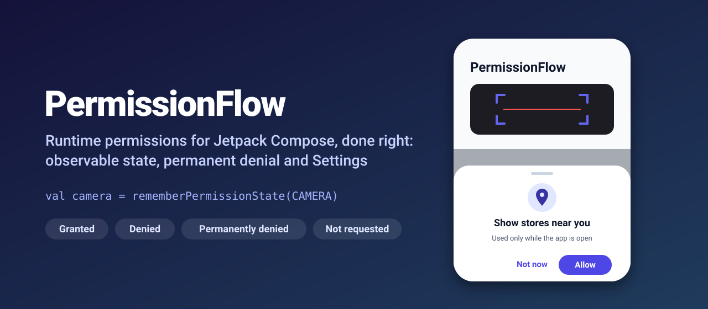
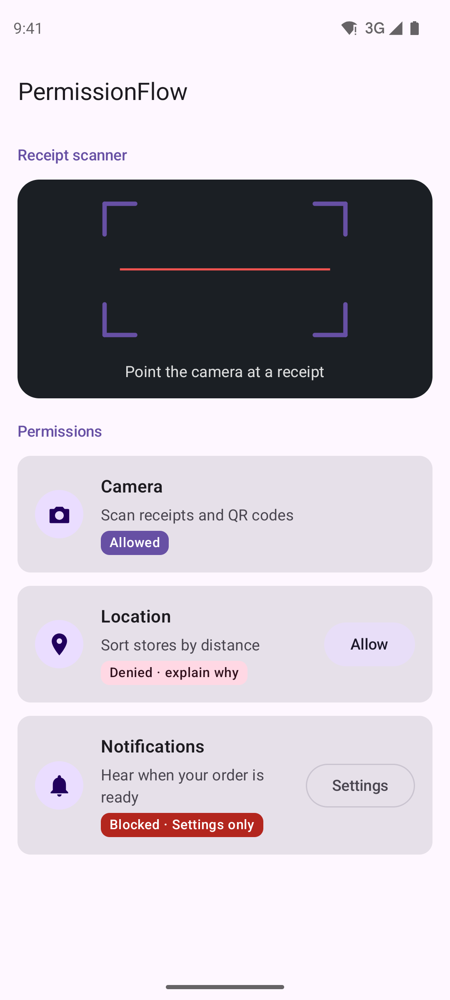
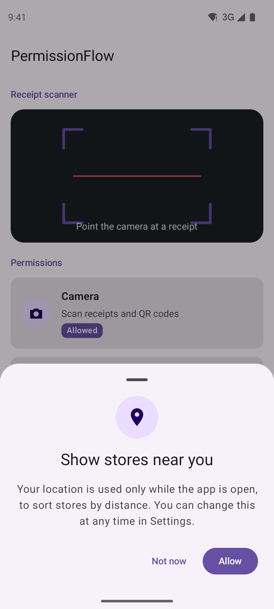
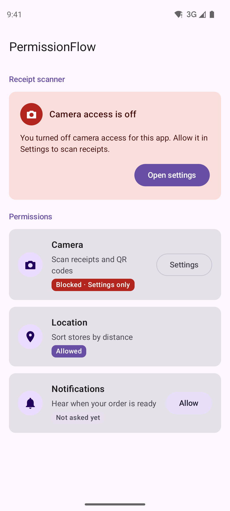
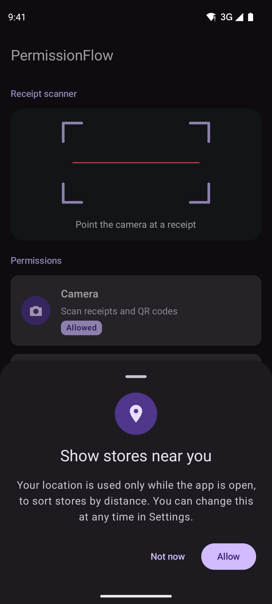

<p align="center">
  
</p>

<p align="center">
  <a href="https://github.com/halilozel1903/PermissionFlow/actions/workflows/ci.yml"></a>
  <a href="https://jitpack.io/#halilozel1903/PermissionFlow"></a>
  
  
  
  <a href="LICENSE"></a>
</p>

**PermissionFlow** is runtime permissions for Jetpack Compose, done right, and a maintained alternative to Accompanist permissions. It gives you an observable status with four clear states, tells "permanently denied" apart from "never asked", refreshes when the user comes back from Settings, knows which permissions exist on which Android version, and ships a Material 3 rationale sheet and an "Open settings" card.

```kotlin
val camera = rememberPermissionState(Manifest.permission.CAMERA)

PermissionGate(camera) {
    CameraPreview()   // only when granted; "Allow" or "Open settings" otherwise
}
```

## Screenshots

Captured from the sample app on an Android emulator by CI. The sample fakes the statuses, so no system dialog is involved.

| Mixed statuses | Rationale sheet | Permanently denied | Dark mode |
| :---: | :---: | :---: | :---: |
|  |  |  |  |

## Why

Android never tells an app whether a denied permission can still be requested. `shouldShowRequestPermissionRationale` is `false` both before the first request and after "Don't ask again", so most apps either nag with a dialog that never appears or send users to Settings too early. Accompanist permissions was the usual answer for Compose, but it has stayed experimental for years and does not tell permanent denial apart. PermissionFlow remembers what it asked for, per permission, and resolves the real state:

| Granted | Rationale | History | Status |
| --- | --- | --- | --- |
| yes | any | any | `Granted` |
| no | `true` | any | `Denied(shouldShowRationale = true)` |
| no | `false` | never requested | `NotRequested` |
| no | `false` | rationale was `true` before | `PermanentlyDenied` |
| no | `false` | requested twice without a rationale | `PermanentlyDenied` |
| no | `false` | requested once, no rationale | `Denied(shouldShowRationale = false)` (dialog dismissed) |

## Features

- 🎯 **Four clear statuses**: `Granted`, `Denied(shouldShowRationale)`, `PermanentlyDenied` and `NotRequested`, as a sealed interface.
- 🧩 **Compose state**: `rememberPermissionState(permission)` and `rememberMultiplePermissionsState(list)` with `launchRequest()`, built on the Activity Result API.
- 🚫 **Permanent denial detection**: request history persisted per permission in SharedPreferences, so it survives restarts.
- 🔄 **Settings round trips**: statuses refresh on `ON_RESUME`, so allowing a permission in Settings shows up the moment the user comes back. `openAppSettings()` gets them there.
- 🚪 **`PermissionGate`**: granted content, a rationale slot and a permanently denied slot in one composable.
- 🎨 **Material 3 UI**: `PermissionRationaleSheet` (icon, title, body, Allow / Not now), `PermissionRequestCard` and `PermissionDeniedCard` with an Open settings button, light and dark.
- 📱 **API level aware**: `POST_NOTIFICATIONS` is granted below 33, `READ_MEDIA_IMAGES` checks `READ_EXTERNAL_STORAGE` below 33, Bluetooth and Wi-Fi permissions fall back to location where Android did, and more.
- 🌊 **Flow for everything else**: `permissionStatusFlow(permission)` for activities, fragments and ViewModels, and `registerPermissionRequester()` for requests without Compose.
- 🧪 **Pure Kotlin core** (`permissionflow-core`): status state machine, request history and API level mapping, unit tested on the JVM. `FakePermissionState` for tests, previews and screenshots.

## Installation

Add JitPack to `settings.gradle.kts`:

```kotlin
dependencyResolutionManagement {
    repositories {
        google()
        mavenCentral()
        maven("https://jitpack.io")
    }
}
```

Then the dependency:

```kotlin
dependencies {
    implementation("com.github.halilozel1903.PermissionFlow:permissionflow:1.0.0")
    // Pure Kotlin state machine and API level mapping only (for JVM/KMP modules):
    // implementation("com.github.halilozel1903.PermissionFlow:permissionflow-core:1.0.0")
}
```

> The build is also set up for Maven Central (`io.github.halilozel1903:permissionflow`) via the vanniktech publish plugin.

Declare the permissions you request in your `AndroidManifest.xml` as usual. PermissionFlow declares none.

## Quick start

**One permission**

```kotlin
@Composable
fun ScannerScreen() {
    val camera = rememberPermissionState(Manifest.permission.CAMERA)

    when (val status = camera.status) {
        PermissionStatus.Granted -> CameraPreview()
        PermissionStatus.PermanentlyDenied -> PermissionDeniedCard()   // "Open settings"
        is PermissionStatus.Denied -> Column {
            if (status.shouldShowRationale) Text("The scanner needs the camera to read receipts.")
            Button(onClick = camera::launchRequest) { Text("Allow camera") }
        }
        PermissionStatus.NotRequested -> Button(onClick = camera::launchRequest) { Text("Scan a receipt") }
    }
}
```

**With the gate and a rationale sheet**

```kotlin
val camera = rememberPermissionState(Manifest.permission.CAMERA)
var explain by rememberSaveable { mutableStateOf(false) }

PermissionGate(
    state = camera,
    rationale = { state ->
        PermissionRequestCard(
            title = "Camera needed to scan",
            onAllow = { if (state.status.shouldShowRationale) explain = true else state.launchRequest() },
        )
    },
    permanentlyDenied = { PermissionDeniedCard(title = "Camera access is off") },
) {
    CameraPreview()
}

if (explain) {
    PermissionRationaleSheet(
        title = "Scan receipts with your camera",
        body = "The camera is only used while the scanner is open. Photos never leave your phone.",
        onAllow = { explain = false; camera.launchRequest() },
        onDismiss = { explain = false },
    )
}
```

**Several permissions together**

```kotlin
val location = rememberMultiplePermissionsState(
    listOf(Manifest.permission.ACCESS_FINE_LOCATION, Manifest.permission.ACCESS_COARSE_LOCATION),
) { results -> analytics.log("location", results) }

location.status               // combined: Granted only when all are granted
location.allPermissionsGranted
location.revokedPermissions   // the ones still missing
location.permissions[0].launchRequest()   // ask for one of them only
```

**Outside Compose**

```kotlin
class ScannerActivity : AppCompatActivity() {
    // Register before the activity is started, like every Activity Result API.
    private val camera = registerPermissionRequester(Manifest.permission.CAMERA) { status ->
        if (status == PermissionStatus.Granted) startScanner()
    }

    override fun onCreate(savedInstanceState: Bundle?) {
        super.onCreate(savedInstanceState)
        lifecycleScope.launch {
            repeatOnLifecycle(Lifecycle.State.STARTED) {
                permissionStatusFlow(Manifest.permission.CAMERA).collect(::render)
            }
        }
        scanButton.setOnClickListener { camera.launch() }
        settingsButton.setOnClickListener { openAppSettings() }
    }
}
```

In a ViewModel, pass the application context and a lifecycle to refresh on:

```kotlin
val notifications: Flow<PermissionStatus> = app.permissionStatusFlow(
    Manifest.permission.POST_NOTIFICATIONS,
    lifecycle = ProcessLifecycleOwner.get().lifecycle,
)
```

Without an activity the rationale can't be read, so the last value seen while an activity was around is used.

## API levels

Pass the permission you mean; PermissionFlow checks and requests what exists on the device.

| Permission | Below | Becomes |
| --- | --- | --- |
| `POST_NOTIFICATIONS` | 33 | granted (see `openNotificationSettings()` if the user turned notifications off) |
| `READ_MEDIA_IMAGES` / `_VIDEO` / `_AUDIO` | 33 | `READ_EXTERNAL_STORAGE` |
| `READ_MEDIA_VISUAL_USER_SELECTED` | 34 | granted (nothing to ask for) |
| `NEARBY_WIFI_DEVICES` | 33 | `ACCESS_FINE_LOCATION` |
| `BODY_SENSORS_BACKGROUND` | 33 | `BODY_SENSORS` |
| `BLUETOOTH_SCAN` | 31 | `ACCESS_FINE_LOCATION` |
| `BLUETOOTH_CONNECT` / `_ADVERTISE`, `UWB_RANGING` | 31 | granted |
| `ACCESS_BACKGROUND_LOCATION` | 29 | `ACCESS_COARSE_LOCATION` (background came with foreground location) |
| `ACTIVITY_RECOGNITION`, `ACCESS_MEDIA_LOCATION` | 29 | granted |
| `READ_PHONE_NUMBERS` | 26 | `READ_PHONE_STATE` |
| `WRITE_EXTERNAL_STORAGE` | from 30 on | granted (no effect with scoped storage) |

Remember to declare the replacements with `android:maxSdkVersion`, for example:

```xml
<uses-permission android:name="android.permission.READ_MEDIA_IMAGES" />
<uses-permission android:name="android.permission.READ_EXTERNAL_STORAGE" android:maxSdkVersion="32" />
```

For photo pickers that don't fit the system Photo Picker, `PermissionFlow.readMediaPermissions(images = true, video = true, allowPartialAccess = true)` returns the right list for the device, including `READ_MEDIA_VISUAL_USER_SELECTED` on API 34+.

## Testing and previews

`@Preview`s get a `FakePermissionState` automatically. In tests and screenshots, pass one yourself:

```kotlin
val camera = FakePermissionState(Manifest.permission.CAMERA, PermissionStatus.PermanentlyDenied) { it.status = PermissionStatus.Granted }
composeRule.setContent { PermissionGate(camera) { Text("Preview") } }
composeRule.onNodeWithText("Open settings").assertIsDisplayed()
```

The state machine lives in `permissionflow-core` and is plain Kotlin:

```kotlin
val controller = PermissionController(listOf(AndroidPermission.CAMERA), fakePlatform, InMemoryPermissionRecordStore())
controller.onRequestResult(mapOf(AndroidPermission.CAMERA to false))
assertEquals(PermissionStatus.Denied(shouldShowRationale = true), controller.snapshot.status)
```

## Good to know

- **Dismissed dialogs.** On Android 11+ tapping outside the dialog is not a denial, so one such request reports `Denied(false)` and the next one shows the dialog again. Two requests in a row that never produce a rationale are reported as `PermanentlyDenied`, which also covers permissions blocked by a device policy or missing from the manifest.
- **Revoked in Settings or a one-time grant expired.** A granted permission clears its history, so the app starts over from `NotRequested` and the system shows the dialog again.
- **`launchRequest()`** must be called from a click handler or an effect, not during composition.
- **Location "approximate only"**: with fine and coarse requested together, a user who picks "Approximate" leaves fine location denied. Check `location.permissions` to degrade gracefully.

## Sample app

The `sample` module shows camera, location and notification permission cards and a receipt scanner behind a `PermissionGate`. It makes real requests, and also accepts a fake scene at launch (used by `scripts/screenshots.sh`):

```bash
./gradlew :sample:installDebug
adb shell am start -n io.github.halilozel1903.permissionflow.sample/.MainActivity --es scene rationale
```

`scene` is one of `overview` (mixed statuses), `rationale` (the rationale sheet open) or `denied` (camera permanently denied, with Open settings). Fake scenes never show a system dialog.

## Project structure

| Module | What it is |
| --- | --- |
| `permissionflow-core` | Pure Kotlin: `PermissionStatus`, the status resolver, request history, `PermissionController` and API level mapping |
| `permissionflow` | Android: Compose states, `PermissionGate`, rationale sheet, cards, Settings helpers, `Flow` API and `PermissionRequester` |
| `sample` | Camera, location and notification cards with fake scenes for screenshots |

## Tech stack

Kotlin 2.4 · AGP 9.4 with built-in Kotlin · Gradle 9.6 · Jetpack Compose (BOM 2026.09) · Material 3 · Activity Result API · Lifecycle Compose · Coroutines & Flow · GitHub Actions

## License

MIT. See [LICENSE](LICENSE).
